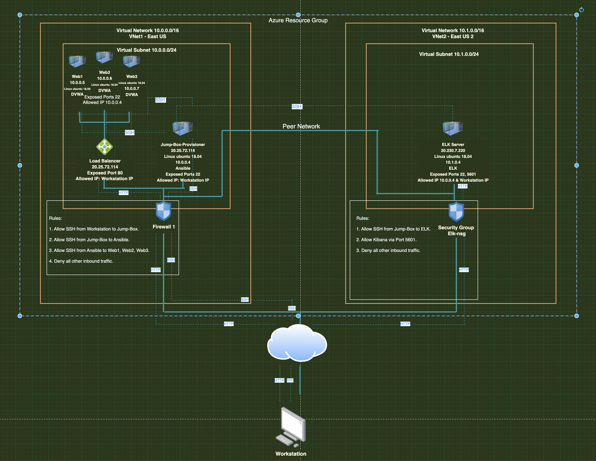

## Automated ELK Stack Deployment

The files in this repository were used to configure the network depicted below.

These files have been tested and used to generate a live ELK deployment on Azure. They can be used to either recreate the entire deployment pictured above. Alternatively, select portions of the playbook file may be used to install only certain pieces of it, such as Filebeat.

  - [ELK Playbook](Ansible/Elk_Playbook.yml)
  - [Filebeat Playbook](Ansible/filebeat-playbook.yml)
  - [Metricbeat Playbook](Ansible/metricbeat-playbook.yml)

This document contains the following details:
- Description of the Topology
- Access Policies
- ELK Configuration
  - Beats in Use
  - Machines Being Monitored
- How to Use the Ansible Build

### Description of the Topology

The main purpose of this network is to expose a load-balanced and monitored instance of DVWA, the D*mn Vulnerable Web Application.

Load balancing ensures that the application will be highly available, in addition to restricting access to the network.
Load balancers distribute incoming network traffic across multiple servers and help to protect the availability of resources. Load balancers protect networks from the open web and can prevent DDoS attacks by balancing traffic.
Using a jump box allows an administrator to easily access and manage all the devices on a network.

Integrating an ELK server allows users to easily monitor the vulnerable VMs for changes to the metrics and system logs.
- Filebeat is installed as an agent on servers and centralizes and forwards log data. Filebeat monitors specified log files or locations, collects log events, and then forwards them to Elasticsearch or Logstash for indexing.
- Metricbeat helps to monitor servers by collecting metrics from the system and server and forwards them to Elasticsearch or Logstash.

The configuration details of each machine may be found below.

| Name                 | Function                  | IP Address | Operating System     |
|----------------------|---------------------------|------------|----------------------|
| Jump-Box-Provisioner | Gateway                   | 10.0.0.4   | Linux (ubuntu 18.04) |
| Web1                 | Webserver - Docker - DVWA | 10.0.0.5   | Linux (ubuntu 18.04) |
| Web2                 | Webserver - Docker - DVWA | 10.0.0.6   | Linux (ubuntu 18.04) |
| Web3                 | Webserver - Docker - DVWA | 10.0.0.7   | Linux (ubuntu 18.04) |
| Elk                  | ELK Stack                 | 10.1.0.4   | Linux (ubuntu 18.04) |

### Access Policies

The machines on the internal network are not exposed to the public Internet. 

Only the Jump-Box_Provisioner machine can accept connections from the Internet. Access to this machine is only allowed from the following IP addresses:
Workstation Public IP Address

Machines within the network can only be accessed by Jump-Box-Provisioner.
- Jump-Box-Provisioner: 10.0.0.4

A summary of the access policies in place can be found in the table below.

| Name                 | Publicly Accessible | Allowed IP Addresses          |
|----------------------|---------------------|-------------------------------|
| Jump-Box_Provisioner | Yes                 | Workstation Public IP Address |
| Web1                 | No                  | 10.0.0.4                      |
| Web2                 | No                  | 10.0.0.4                      |
| Web3                 | No                  | 10.0.0.4                      |
| Elk                  | Yes                 | Workstation Public IP Address |

### Elk Configuration

Ansible was used to automate configuration of the ELK machine. No configuration was performed manually, which is advantageous because it reduces errors and is time-efficient

The playbook implements the following tasks:
- Increases the Virtual Memory.

- Installs Docker.io, pip3, and the Docker module.

- Launches and installs the docker ELK container

The following screenshot displays the result of running `docker ps` after successfully configuring the ELK instance.

### Target Machines & Beats
This ELK server is configured to monitor the following machines:
- Web1: 10.0.0.5
- Web2: 10.0.0.6
- Web3: 10.0.0.7

We have installed the following Beats on these machines:
- Filebeat
- Metricbeat

These Beats allow us to collect the following information from each machine:
- Filebeat generates and organizes log related to the file system, including which files have changed and when.
- Metricbeat collects metric data from the target server, such as operating system metrics like CPU and memory, or data related to services running on the server.

### Using the Playbook
In order to use the playbook, you will need to have an Ansible control node already configured. Assuming you have such a control node provisioned: 

SSH into the control node and follow the steps below:
- Copy the configuration file to the webservers and ELK server.
- Update the /etc/ansible/hosts file to include the internal IP addresses.
- Run the playbook, and navigate to Kibana to check that the installation worked as expected.

- Which file is the playbook? Where do you copy it? 
  - The file Elk_playbook.yml should be copied to /etc/ansible on the Web VMs
- Which file do you update to make Ansible run the playbook on a specific machine? How do I specify which machine to install the ELK server on versus which to install Filebeat on?_ 
  - The /etc/ansible/hosts file should be updated with the specific IP address. 
  - To specify which machine to install the ELK server, you would update the hosts field at the top of the playbook.
- Which URL do you navigate to in order to check that the ELK server is running?
  - http://[ELK-VM-External-IP]:5601/app/kibana

